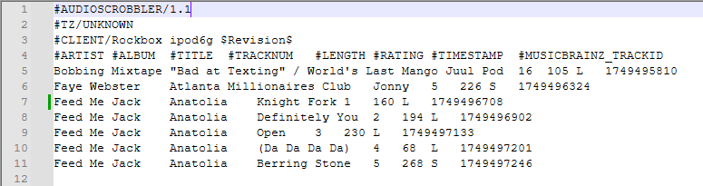
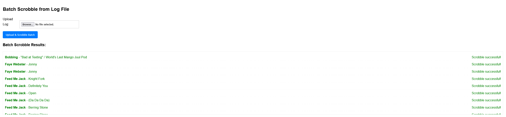

# Maloja Manual Scrobbler

A python and Flask web to manually scrobble songs to a Maloja instance. 

Searches Musicbrainz database to help fill form with search results.

Set up: Navigate to Options page and input your Maloja service URL and API Key. 

Single Scrobble: Fill in your track metadata and Scrobble!

Multi Scrobble from Rockbox Plugin: 
Expects the format from Rockbox "lastfm_scrobbler"

Upload the log file and Scrobble!

