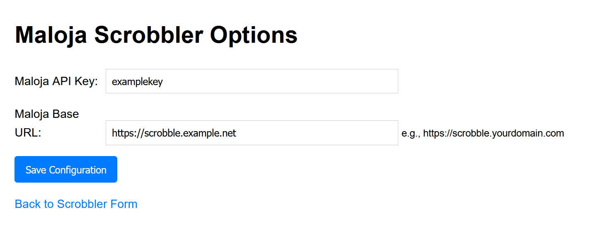
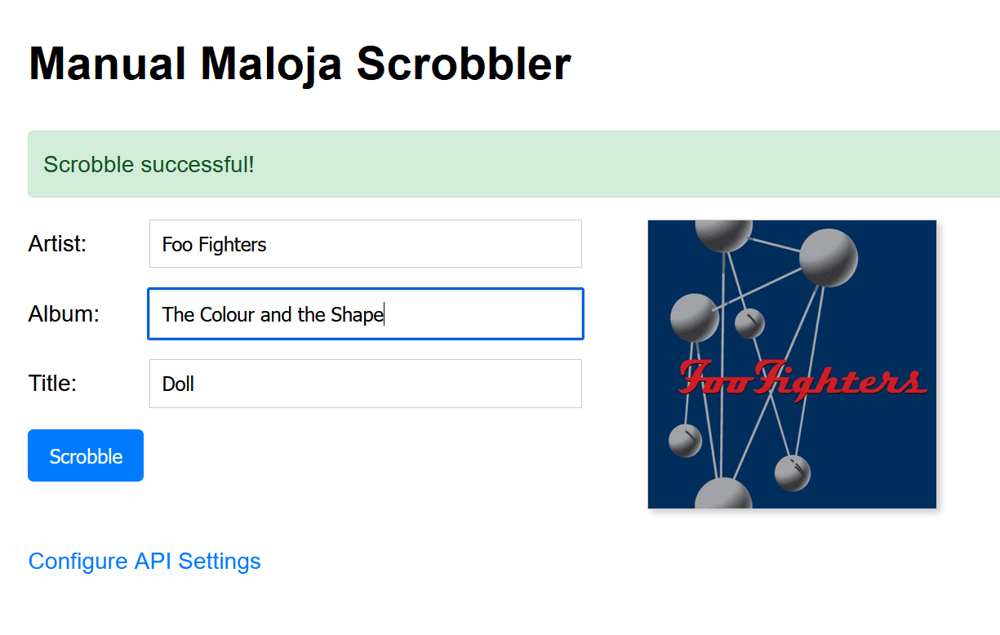

# Maloja Manual Scrobbler

A python and Flask web all to manually scrobble songs to a Maloja instance. 

Searches Musicbrainz database to help fill form with search results.

Set up: Navigate to Options page and input your Maloja service URL and API Key. 

Fill in your track metadata and Scrobble!
